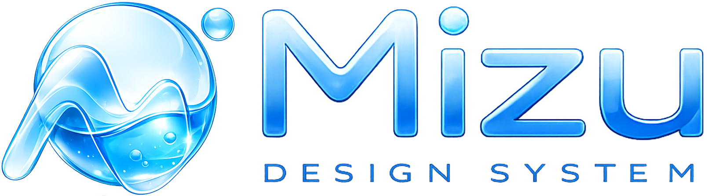

<div align="center">



# Mizu 水

**The design system for AI products.**

Clean, airy components for AI products and the designers building them. Chat, voice, reasoning, and streaming for Svelte 5 and Tailwind v4. Copy in what you need.

<p>
	
	
	
	
	
</p>

</div>

---

Mizu is built for AI products: chat, voice, reasoning, and streaming components in a language of white on white, shadows you feel more than see, one blue accent, and a soft pastel glow reserved for the moments where the AI is present. Quiet surfaces, generous rounding, and restraint everywhere else. Everything ships as source you copy into your project and own. No black box, no version lock. One command adds a component (the registry works with the shadcn-svelte CLI you already have), or copy from any docs page.

## Highlights

- **74 components**, from buttons and dialogs to streaming text, visible reasoning, tool calls, a voice orb, and a drifting pastel aurora.
- **Recolor from one token.** The accent, glow, and focus ring all derive from `--primary`. Change it once and the whole system follows.
- **Quiet by default.** Hierarchy comes from space, hairlines, and type. The accent and the glow are reserved for what matters.
- **Svelte 5 native.** Runes and snippets throughout, with [bits-ui](https://bits-ui.com) handling accessible behavior under the quiet skin.
- **Airy light, pure-black dark.** A white light theme and a pure-black dark theme with slate surfaces, both with the blue accent on top.
- **Copy in, own it.** A shadcn-svelte-compatible registry, plus full source on every component page.

## Quick start

Mizu runs on SvelteKit, Svelte 5, and Tailwind v4.

**1. Create the app:**

```bash
npx sv create my-app
cd my-app
npx sv add tailwindcss
```

**2. Add a `components.json`** so the CLI knows where to place files (or run `npx shadcn-svelte@latest init` to generate it). Point `tailwind.css` at **your** Tailwind entry, the file that holds `@import 'tailwindcss';`. Recent `sv add tailwindcss` creates `src/routes/layout.css`; older setups use `src/app.css`. Use whichever you have:

```json
{
	"$schema": "https://shadcn-svelte.com/schema.json",
	"tailwind": { "css": "src/routes/layout.css", "baseColor": "neutral" },
	"aliases": {
		"lib": "$lib",
		"utils": "$lib/utils",
		"components": "$lib/components",
		"ui": "$lib/components/ui",
		"hooks": "$lib/hooks"
	},
	"typescript": true,
	"registry": "https://shadcn-svelte.com/registry"
}
```

**3. Add the theme:** paste Mizu's `src/app.css` (this repo's) into that same Tailwind entry file, right after `@import 'tailwindcss';`.

**4. Add components** with the one-liner. It pulls the component, installs its npm dependencies, and adds the shared `cn` helper automatically:

```bash
npx shadcn-svelte@latest add https://mizu-ui.com/r/button.json
```

You can also open any component page in the docs and copy its source straight into `src/lib/components/ui/`.

> The registry is served from [mizu-ui.com](https://mizu-ui.com). If you fork Mizu, point `repo` and `registryBase` in `src/lib/site/config.ts` at your own deployment and re-run `pnpm registry:build`.

## Usage

```svelte
<script lang="ts">
	import { Button } from '$lib/components/ui/button';
	import * as Card from '$lib/components/ui/card';
</script>

<Card.Root class="max-w-sm">
	<Card.Header>
		<Card.Title>Clear morning</Card.Title>
		<Card.Description>A white surface with a hairline border and a soft shadow.</Card.Description>
	</Card.Header>
	<Card.Footer>
		<Button class="w-full">Continue</Button>
	</Card.Footer>
</Card.Root>
```

## Theming

The brand is one token. Change `--primary` and the accent, glow, and focus ring follow:

```css
:root {
	--primary: #00b2ff; /* the default */
}
```

Everything is driven by CSS variables: an airy light mode and a pure-black dark mode out of the box, plus a single `--primary` token (the default is `#00b2ff`) that recolors the whole system without touching a component.

## Components

| Group      | Components                                                                                                                                          |
| ---------- | --------------------------------------------------------------------------------------------------------------------------------------------------- |
| Actions    | Button, Badge, Button Group                                                                                                                         |
| Forms      | Input, Textarea, Label, Checkbox, Radio Group, Switch, Slider, Select, Native Select, Combobox, Toggle, Toggle Group, Input OTP, Input Group, Field |
| Surfaces   | Card, Alert, Separator, Avatar, Aspect Ratio, Scroll Area, Table, Empty, Item, Kbd                                                                  |
| Overlays   | Dialog, Alert Dialog, Sheet, Popover, Tooltip, Hover Card                                                                                           |
| Menus      | Dropdown Menu, Context Menu, Menubar, Navigation Menu, Command                                                                                      |
| Navigation | Tabs, Accordion, Collapsible, Breadcrumb, Pagination                                                                                                |
| Feedback   | Progress, Skeleton, Spinner, Circular Gauge                                                                                                         |
| AI         | Aurora, Chat Input, Chat Bubble, Streaming Text, Reasoning, Tool Call, Sources, Message Actions, Voice Orb, Waveform, Prompt Suggestions, Thinking                                                                                                                                        |

## Develop

```bash
pnpm install
pnpm dev              # docs site + live previews
pnpm check            # type-check
pnpm registry:build   # regenerate static/r/*.json from the component source
```

The docs site lives in `src/routes`, components in `src/lib/components/ui`, the design tokens in `src/app.css`, and the site chrome (landing showcase, theming, command palette) in `src/lib/site`. To add a component: build it, list it in `src/lib/site/components.json`, write a demo in `src/lib/site/demos`, and re-run the registry build.

## Built with

Svelte 5, SvelteKit, Tailwind CSS v4, bits-ui, tailwind-variants, and Lucide icons (with Phosphor in the docs site). Inspired by shadcn-svelte and the quiet confidence of modern AI interfaces.

## License

[MIT](./LICENSE)
