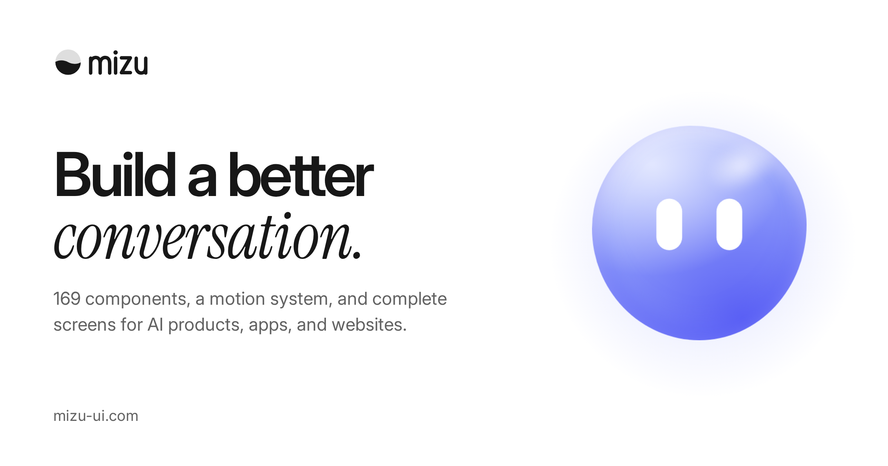
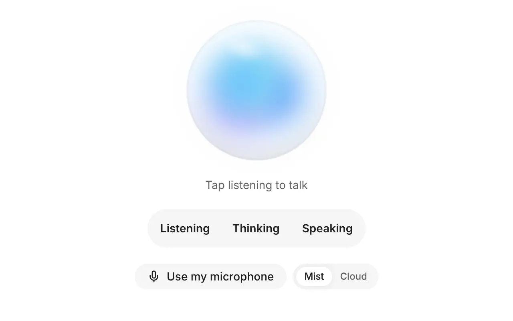
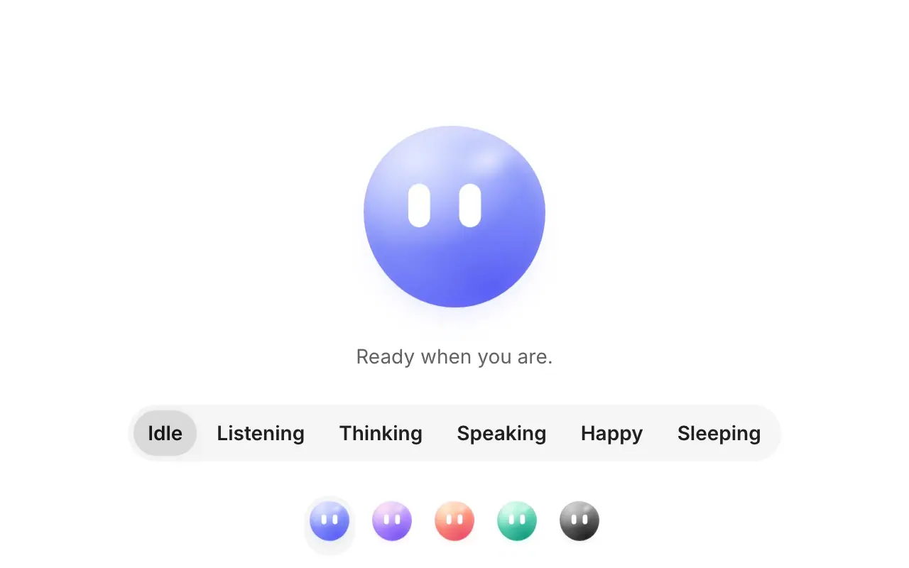
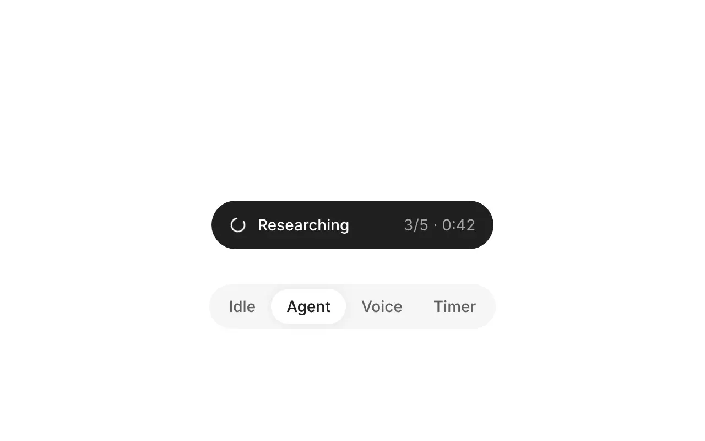
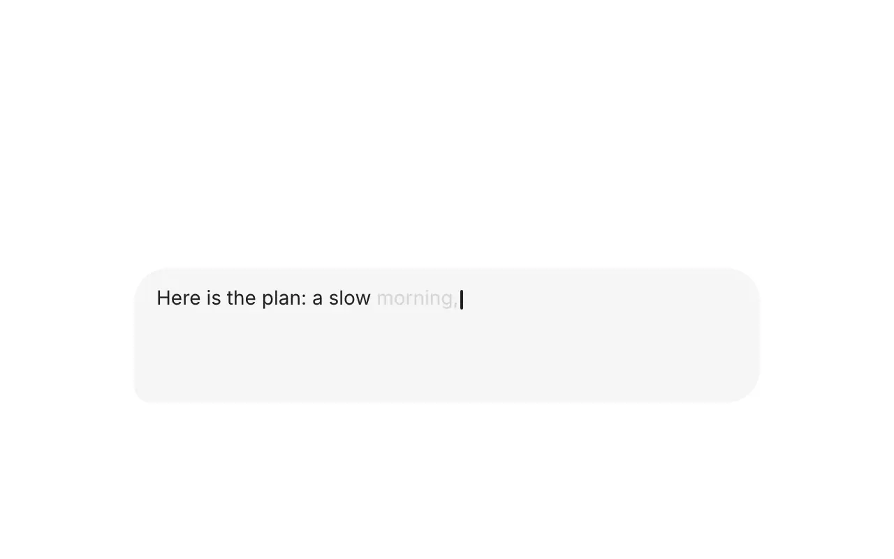
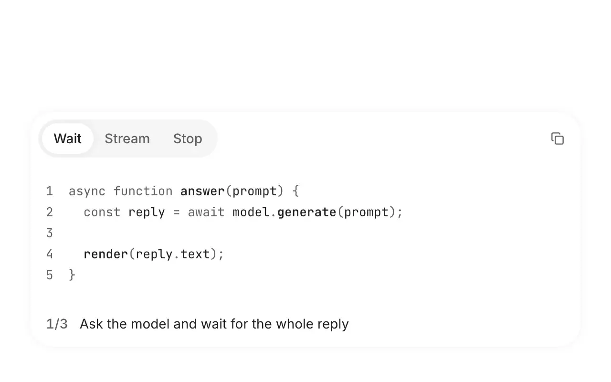
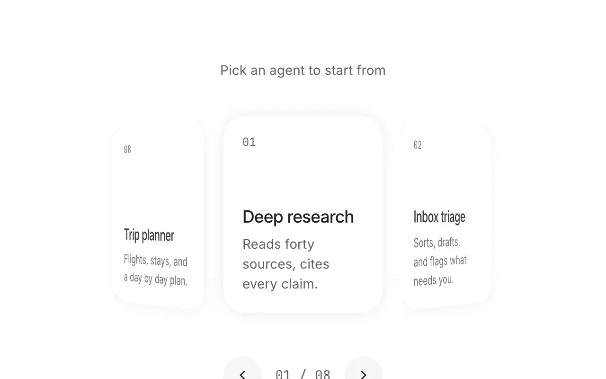
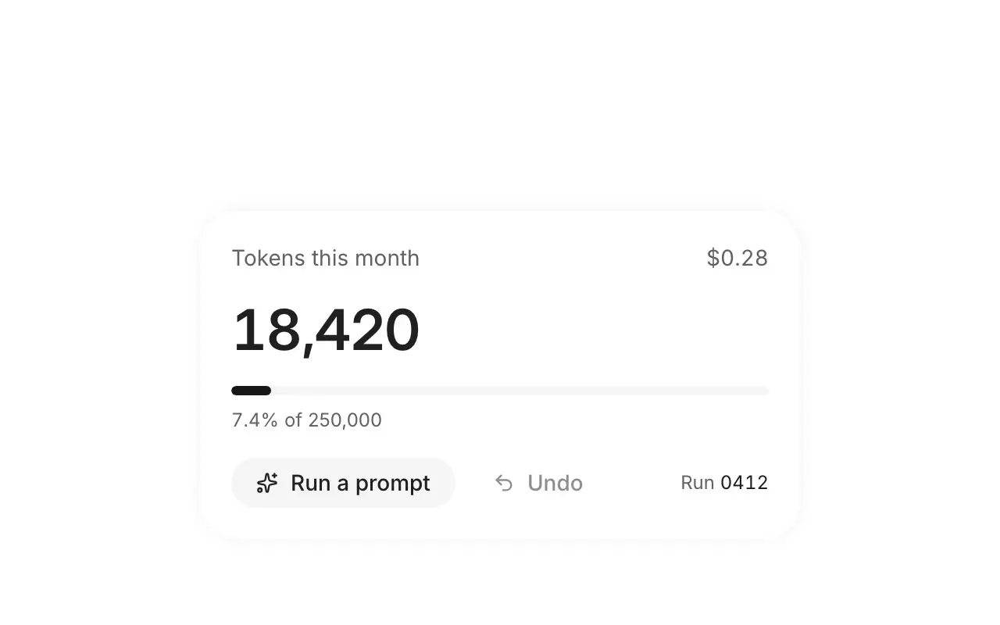
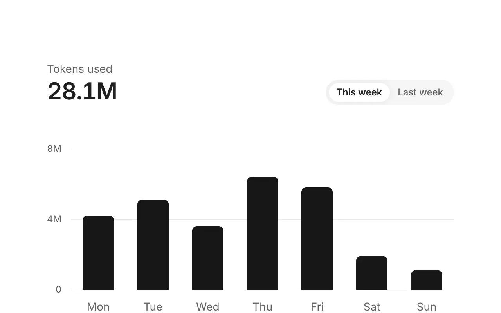

<p align="center">
  <a href="https://mizu-ui.com">
    <picture>
      <source media="(prefers-color-scheme: dark)" srcset="./static/brand/mizu-lockup-inverse.svg">
      
    </picture>
  </a>
</p>

<h3 align="center">The design system for AI products.</h3>

<p align="center">
  Conversation, voice, motion, and app components for Svelte 5 and Tailwind v4.<br>
  Copy the source. Make it yours.
</p>

<p align="center">
  <a href="./LICENSE"></a>
  <a href="https://github.com/dyascj/mizu/actions/workflows/ci.yml"></a>
  
  
  
  
</p>

<p align="center">
  <a href="https://mizu-ui.com/docs"><b>Docs</b></a>
  &nbsp;·&nbsp;
  <a href="https://mizu-ui.com/docs/components"><b>Components</b></a>
  &nbsp;·&nbsp;
  <a href="https://mizu-ui.com/blocks"><b>Blocks</b></a>
  &nbsp;·&nbsp;
  <a href="#install"><b>Install</b></a>
  &nbsp;·&nbsp;
  <a href="https://mizu-ui.com/docs/motion"><b>Motion</b></a>
  &nbsp;·&nbsp;
  <a href="https://mizu-ui.com/docs/agents"><b>AI tools</b></a>
</p>

<p align="center">
  
</p>

Mizu is a design system for products with intelligence inside. It starts with the conversation (streaming answers, visible reasoning, tool calls, voice) and carries the same language into installable apps and the websites that launch them. Black, white, and neutral grays hold the structure. Color and motion mark the moments when an AI is at work. Every component is plain Svelte source you own, installed with the shadcn-svelte CLI or copied by hand, with a live preview at [mizu-ui.com](https://mizu-ui.com).

## Showcase

A few favorites, recorded live from [mizu-ui.com](https://mizu-ui.com). Each one follows your light or dark setting.

<table>
<tr>
<td width="50%" valign="top">
<a href="https://mizu-ui.com/docs/components/voice-orb"><picture>
<source media="(prefers-color-scheme: dark)" srcset="./.github/assets/showcase/voice-orb-dark.webp">

</picture></a>
<br><a href="https://mizu-ui.com/docs/components/voice-orb"><b>Voice Orb</b></a><br>
<sub>Glassy mist that listens, swirls while thinking, and breathes while speaking.</sub>
</td>
<td width="50%" valign="top">
<a href="https://mizu-ui.com/docs/components/presence"><picture>
<source media="(prefers-color-scheme: dark)" srcset="./.github/assets/showcase/presence-dark.webp">

</picture></a>
<br><a href="https://mizu-ui.com/docs/components/presence"><b>Presence</b></a><br>
<sub>A companion that shows when an assistant is listening, thinking, speaking, or done.</sub>
</td>
</tr>
<tr>
<td width="50%" valign="top">
<a href="https://mizu-ui.com/docs/components/dynamic-island"><picture>
<source media="(prefers-color-scheme: dark)" srcset="./.github/assets/showcase/dynamic-island-dark.webp">

</picture></a>
<br><a href="https://mizu-ui.com/docs/components/dynamic-island"><b>Dynamic Island</b></a><br>
<sub>A pill that morphs between live activities with a springy bounce.</sub>
</td>
<td width="50%" valign="top">
<a href="https://mizu-ui.com/docs/components/streaming-text"><picture>
<source media="(prefers-color-scheme: dark)" srcset="./.github/assets/showcase/streaming-text-dark.webp">

</picture></a>
<br><a href="https://mizu-ui.com/docs/components/streaming-text"><b>Streaming Text</b></a><br>
<sub>Token-by-token text that types itself in, caret and all.</sub>
</td>
</tr>
<tr>
<td width="50%" valign="top">
<a href="https://mizu-ui.com/docs/components/code-morph"><picture>
<source media="(prefers-color-scheme: dark)" srcset="./.github/assets/showcase/code-morph-dark.webp">

</picture></a>
<br><a href="https://mizu-ui.com/docs/components/code-morph"><b>Code Morph</b></a><br>
<sub>Every surviving token glides to its new spot as the code changes.</sub>
</td>
<td width="50%" valign="top">
<a href="https://mizu-ui.com/docs/components/carousel-3d"><picture>
<source media="(prefers-color-scheme: dark)" srcset="./.github/assets/showcase/carousel-3d-dark.webp">

</picture></a>
<br><a href="https://mizu-ui.com/docs/components/carousel-3d"><b>Carousel 3D</b></a><br>
<sub>Spin a ring of cards and flick it to land on the one you want.</sub>
</td>
</tr>
<tr>
<td width="50%" valign="top">
<a href="https://mizu-ui.com/docs/components/number-ticker"><picture>
<source media="(prefers-color-scheme: dark)" srcset="./.github/assets/showcase/number-ticker-dark.webp">

</picture></a>
<br><a href="https://mizu-ui.com/docs/components/number-ticker"><b>Number Ticker</b></a><br>
<sub>Digits roll into place when the value changes.</sub>
</td>
<td width="50%" valign="top">
<a href="https://mizu-ui.com/docs/components/bar-chart"><picture>
<source media="(prefers-color-scheme: dark)" srcset="./.github/assets/showcase/bar-chart-dark.webp">

</picture></a>
<br><a href="https://mizu-ui.com/docs/components/bar-chart"><b>Bar Chart</b></a><br>
<sub>Bars grow from the baseline and spring between series.</sub>
</td>
</tr>
</table>

## Contents

- [Showcase](#showcase)
- [Highlights](#highlights)
- [Install](#install)
  - [Requirements](#requirements)
  - [With the shadcn-svelte CLI](#with-the-shadcn-svelte-cli)
  - [Copy and paste](#copy-and-paste)
- [Usage](#usage)
- [Motion tokens](#motion-tokens)
- [Theming](#theming)
- [Components](#components)
- [Blocks](#blocks)
- [AI tools](#ai-tools)
- [How releases work](#how-releases-work)
- [Repository layout](#repository-layout)
- [Develop](#develop)
- [Built with](#built-with)
- [Community](#community)
- [License](#license)

## Highlights

- **169 components** for AI, motion, apps, forms, overlays, navigation, and data, from a chat composer and a voice orb to a kanban board, a color picker, and a dynamic island.
- **Presence.** A companion that shows whether the assistant is listening, thinking, speaking, or done, in five tones.
- **A motion system.** Duration, easing, and spring tokens in the theme. Springs are sampled from real physics into CSS `linear()` curves, so they cost nothing at runtime.
- **Apps and PWAs.** Tab bars, install prompts, offline status, and safe-area utilities for web apps people install.
- **Complete screens.** Assistant chat, voice mode, agent workflows, a mobile assistant, a product landing page, and more, each one file you own.
- **Accessible by default.** bits-ui behavior underneath, axe checks on every component in both themes, and reduced motion respected everywhere.
- **Recolor from one token.** Accent states, selection fills, and the focus ring follow `--primary`.
- **Copy in, own it.** A shadcn-svelte-compatible registry with immutable versioned releases.

The current stable release is `0.6.0`. Pin it for reproducible installs:

```bash
npx shadcn-svelte@latest add https://mizu-ui.com/r/v0.6.0/button.json
```

Upgrading copied components from 0.4.x means reinstalling them with the 0.5 Motion item. See the [0.5.0 migration notes](./CHANGELOG.md#050---2026-09-26). From 0.3.x, reinstall the theme first, as described in the [0.4.0 notes](./CHANGELOG.md#040---2026-09-25).

## Install

### Requirements

- **SvelteKit** with **Svelte 5** and TypeScript
- **Tailwind CSS v4**
- The `$lib` alias (SvelteKit's default). Some items also use [bits-ui](https://bits-ui.com) or [Lucide](https://lucide.dev) icons; the CLI installs whatever an item needs.

### With the shadcn-svelte CLI

**1. Create the app:**

```bash
npx sv create my-app
cd my-app
npx sv add tailwindcss
```

**2. Add a `components.json`** so the CLI knows where to place files (or run `npx shadcn-svelte@latest init` to generate it). Point `tailwind.css` at **your** Tailwind entry, the file that holds `@import 'tailwindcss';`. Recent `sv add tailwindcss` creates `src/routes/layout.css`; older setups use `src/app.css`. Use whichever you have:

```json
{
	"$schema": "https://shadcn-svelte.com/schema.json",
	"tailwind": { "css": "src/routes/layout.css", "baseColor": "neutral" },
	"aliases": {
		"lib": "$lib",
		"utils": "$lib/utils",
		"components": "$lib/components",
		"ui": "$lib/components/ui",
		"hooks": "$lib/hooks"
	},
	"typescript": true,
	"registry": "https://shadcn-svelte.com/registry"
}
```

**3. Add the theme:** paste Mizu's `src/app.css` (this repo's) into that same Tailwind entry file, right after `@import 'tailwindcss';`. It holds the color, elevation, and motion tokens every component reads.

**4. Add components** with the one-liner. It pulls the component, installs its npm dependencies, and adds the shared `cn` helper automatically:

```bash
npx shadcn-svelte@latest add https://mizu-ui.com/r/v0.6.0/button.json
```

> Versioned registry URLs are immutable. Use `/r/latest/<item>.json` only when you intentionally want the newest release. See the [compatibility policy](./docs/compatibility.md). If you fork Mizu, point `repo` and `registryBase` in `src/lib/site/config.ts` at your own deployment and re-run `pnpm registry:build`.

### Copy and paste

Every component page on [mizu-ui.com](https://mizu-ui.com/docs/components) has a Code tab and the full source of each file. Copy them into `src/lib/components/ui/<name>/`, keep the theme from step 3, and install any packages the file imports.

## Usage

```svelte
<script lang="ts">
	import { ChatInput } from '$lib/components/ui/chat-input';
	import { Presence } from '$lib/components/ui/presence';
	import { TextReveal } from '$lib/components/ui/text-reveal';

	let answer = $state('');
	let thinking = $state(false);

	async function ask(message: string) {
		thinking = true;
		answer = await yourModel(message);
		thinking = false;
	}
</script>

<div class="flex items-start gap-3">
	<Presence state={thinking ? 'thinking' : answer ? 'speaking' : 'idle'} size={36} />
	{#if answer}<TextReveal text={answer} />{/if}
</div>
<ChatInput onSubmit={ask} placeholder="Ask anything" />
```

## Motion tokens

Motion is quick to respond and soft to settle. Use the tokens instead of literal values:

```svelte
<div class="transition-[scale] duration-(--duration-spring) ease-spring hover:scale-[1.02]">
<li class="animate-rise-in stagger" style="--index: {index}">...</li>
<span class="text-shimmer animate-shimmer">Searching the web</span>
```

The Motion registry item adds `rise`, `blurIn`, and `pop` transitions, `reveal` and `magnetic` attachments, and `SpringValue`, a velocity-preserving spring that is safe in SSR and tests. Read the [motion guide](https://mizu-ui.com/docs/motion).

## Theming

The default primary is black in light mode and white in dark mode. Custom themes set the primary color and its foreground together:

```css
:root {
	--primary: #171717;
	--primary-foreground: #ffffff;
}

.dark {
	--primary: #f5f5f5;
	--primary-foreground: #171717;
}
```

CSS variables also define card, popover, and control fills, elevation, and motion. See the [theming guide](https://mizu-ui.com/docs/theming).

## Components

Mizu currently includes 169 components across AI, motion, app, actions, forms, surfaces, data, overlays, menus, navigation, and feedback. Click a name for the live preview, code, and API reference. Install any of them by slug:

```bash
npx shadcn-svelte@latest add https://mizu-ui.com/r/v0.6.0/<slug>.json
```

[AI](#ai) (21) · [Motion](#motion) (21) · [App](#app) (6) · [Actions](#actions) (18) · [Forms](#forms) (32) · [Surfaces](#surfaces) (23) · [Data](#data) (8) · [Overlays](#overlays) (11) · [Menus](#menus) (5) · [Navigation](#navigation) (14) · [Feedback](#feedback) (10)

### AI

| Component                                                                    | Description                                                                                                                               |
| ---------------------------------------------------------------------------- | ----------------------------------------------------------------------------------------------------------------------------------------- |
| [Aurora](https://mizu-ui.com/docs/components/aurora)                         | A slow, drifting pastel-aura backdrop.                                                                                                    |
| [Chat Input](https://mizu-ui.com/docs/components/chat-input)                 | A message composer with optional attachment and voice actions.                                                                            |
| [Chat Bubble](https://mizu-ui.com/docs/components/chat-bubble)               | User and assistant message bubbles, flat and quiet.                                                                                       |
| [Streaming Text](https://mizu-ui.com/docs/components/streaming-text)         | Token-by-token text that types itself in, caret and all.                                                                                  |
| [Reasoning](https://mizu-ui.com/docs/components/reasoning)                   | A collapsible chain of thought: shimmers while thinking, folds away when done.                                                            |
| [Tool Call](https://mizu-ui.com/docs/components/tool-call)                   | Live status for a tool the assistant is using, with an expandable result.                                                                 |
| [Sources](https://mizu-ui.com/docs/components/sources)                       | Numbered citation chips that ground an answer.                                                                                            |
| [Message Actions](https://mizu-ui.com/docs/components/message-actions)       | Copy, regenerate, and feedback beneath a reply.                                                                                           |
| [Plan](https://mizu-ui.com/docs/components/plan)                             | The agent's step list: shimmer while working, checks as it lands.                                                                         |
| [Nudge](https://mizu-ui.com/docs/components/nudge)                           | A proactive suggestion from the assistant, easy to act on or dismiss.                                                                     |
| [Aura Tile](https://mizu-ui.com/docs/components/aura-tile)                   | Seeded pastel cover art for anything the AI generates.                                                                                    |
| [Voice Orb](https://mizu-ui.com/docs/components/voice-orb)                   | A voice orb in two styles: a folded cloud, or glassy mist that listens to a live mic, swirls while thinking, and breathes while speaking. |
| [Waveform](https://mizu-ui.com/docs/components/waveform)                     | Animated voice bars for listening and speaking states.                                                                                    |
| [Prompt Suggestions](https://mizu-ui.com/docs/components/prompt-suggestions) | Starter prompt chips that invite the first message.                                                                                       |
| [Thinking](https://mizu-ui.com/docs/components/thinking)                     | Shimmer and typing-dot indicators for a working assistant.                                                                                |
| [Presence](https://mizu-ui.com/docs/components/presence)                     | An expressive companion that shows when an assistant is listening, thinking, speaking, or done.                                           |
| [Conversation](https://mizu-ui.com/docs/components/conversation)             | A message thread that follows new replies only while you are at the bottom.                                                               |
| [Feedback Prompt](https://mizu-ui.com/docs/components/feedback-prompt)       | Asks whether a response helped, and opens into a field right where the question was.                                                      |
| [Call Controls](https://mizu-ui.com/docs/components/call-controls)           | Accept turns into hang up as the call controls unfold out of it.                                                                          |
| [Audio Player](https://mizu-ui.com/docs/components/audio-player)             | Inks in a voice note waveform with chapter markers and a ghost playhead.                                                                  |
| [Greeting](https://mizu-ui.com/docs/components/greeting)                     | Greets by time of day as a sun or moon rises into place along an arc.                                                                     |

### Motion

| Component                                                            | Description                                                                                |
| -------------------------------------------------------------------- | ------------------------------------------------------------------------------------------ |
| [Motion](https://mizu-ui.com/docs/components/motion)                 | Easing, springs, transitions, and scroll reveals that share the theme's motion tokens.     |
| [Text Reveal](https://mizu-ui.com/docs/components/text-reveal)       | Reveals a line or an answer word by word or character by character, on mount or on scroll. |
| [Text Rotate](https://mizu-ui.com/docs/components/text-rotate)       | Cycles a word in place while the line around it eases to fit.                              |
| [Number Ticker](https://mizu-ui.com/docs/components/number-ticker)   | A formatted number whose digits roll into place when the value changes.                    |
| [Marquee](https://mizu-ui.com/docs/components/marquee)               | An endless, pausable scroller for logos, testimonials, and prompt chips.                   |
| [Text Scramble](https://mizu-ui.com/docs/components/text-scramble)   | A block cursor reads a word in, one letter at a time.                                      |
| [Typewriter](https://mizu-ui.com/docs/components/typewriter)         | Types, pauses, and rewrites the last word with a human rhythm.                             |
| [Wave Text](https://mizu-ui.com/docs/components/wave-text)           | Letters rise in a wave that follows your cursor.                                           |
| [Spoiler](https://mizu-ui.com/docs/components/spoiler)               | Hides text under shimmering grain that blows away from your click.                         |
| [Highlight](https://mizu-ui.com/docs/components/highlight)           | Swipes a highlighter across a line when it comes into view.                                |
| [Code Morph](https://mizu-ui.com/docs/components/code-morph)         | Glides every surviving token to its new spot as code changes.                              |
| [Icon Morph](https://mizu-ui.com/docs/components/icon-morph)         | Icons reshape between states instead of swapping.                                          |
| [Confetti](https://mizu-ui.com/docs/components/confetti)             | A burst of confetti for moments worth celebrating, as a button or a confetti() call.       |
| [Tilt Card](https://mizu-ui.com/docs/components/tilt-card)           | Leans toward your cursor with a glare that follows the light.                              |
| [Spotlight Card](https://mizu-ui.com/docs/components/spotlight-card) | Cards catch the glow of a cursor lamp.                                                     |
| [Flip Card](https://mizu-ui.com/docs/components/flip-card)           | Turns over in 3D to show what is on the back.                                              |
| [Lens](https://mizu-ui.com/docs/components/lens)                     | A lens follows your cursor and reveals what is hidden underneath.                          |
| [Sticky Stack](https://mizu-ui.com/docs/components/sticky-stack)     | Cards pile up and sink back as you scroll.                                                 |
| [Carousel 3D](https://mizu-ui.com/docs/components/carousel-3d)       | Spin a ring of cards and flick it to land on the one you want.                             |
| [Logo Orbit](https://mizu-ui.com/docs/components/logo-orbit)         | Logos orbit a heading on tilted rings and brake when you point.                            |
| [Dot Grid](https://mizu-ui.com/docs/components/dot-grid)             | Dots swell and part around your cursor, and a click sends a shockwave.                     |

### App

| Component                                                              | Description                                                                             |
| ---------------------------------------------------------------------- | --------------------------------------------------------------------------------------- |
| [Tab Bar](https://mizu-ui.com/docs/components/tab-bar)                 | Bottom navigation for mobile apps and PWAs, with a sliding indicator and unread badges. |
| [Install Prompt](https://mizu-ui.com/docs/components/install-prompt)   | A card that offers to install your PWA, with Add to Home Screen steps on iOS.           |
| [Network Status](https://mizu-ui.com/docs/components/network-status)   | An online and offline indicator that reassures people their changes will sync.          |
| [Dynamic Island](https://mizu-ui.com/docs/components/dynamic-island)   | A pill that morphs between live activities with a springy bounce.                       |
| [Pull to Refresh](https://mizu-ui.com/docs/components/pull-to-refresh) | Pull a feed down and new items slide in at the top.                                     |
| [Story Progress](https://mizu-ui.com/docs/components/story-progress)   | Tap through stories, and hold to pause.                                                 |

### Actions

| Component                                                                  | Description                                                                                                   |
| -------------------------------------------------------------------------- | ------------------------------------------------------------------------------------------------------------- |
| [Button](https://mizu-ui.com/docs/components/button)                       | Pill actions with neutral, semantic, and AI variants.                                                         |
| [Badge](https://mizu-ui.com/docs/components/badge)                         | Compact status pills in soft intent colors.                                                                   |
| [Button Group](https://mizu-ui.com/docs/components/button-group)           | Buttons joined into one segmented control.                                                                    |
| [Hold Button](https://mizu-ui.com/docs/components/hold-button)             | A pill you press and hold to confirm, with a fill that sweeps across and an optional bin lid that slams shut. |
| [Copy Button](https://mizu-ui.com/docs/components/copy-button)             | Copies a value as its two pages merge and a check draws in, or flips its letters into a confirmation.         |
| [Upload Button](https://mizu-ui.com/docs/components/upload-button)         | Shrinks into a progress ring while a file uploads, then checks off.                                           |
| [Download Button](https://mizu-ui.com/docs/components/download-button)     | The arrow drops into the tray while the pill fills with progress.                                             |
| [Async Button](https://mizu-ui.com/docs/components/async-button)           | Shrinks into a spinner while it works, then answers with a check or a shake.                                  |
| [Send Button](https://mizu-ui.com/docs/components/send-button)             | The plane lifts off along a curve and a check lands in its place. Pairs with chat composers.                  |
| [Slide to Confirm](https://mizu-ui.com/docs/components/slide-to-confirm)   | Drag the knob across to confirm a consequential action.                                                       |
| [Share Button](https://mizu-ui.com/docs/components/share-button)           | Opens in place into share targets, and the link turns into a check once copied.                               |
| [Like Button](https://mizu-ui.com/docs/components/like-button)             | Pops, bursts, and rolls its count when liked.                                                                 |
| [Star Button](https://mizu-ui.com/docs/components/star-button)             | Spins once, throws off sparks, and rolls the count.                                                           |
| [Bookmark Button](https://mizu-ui.com/docs/components/bookmark-button)     | Fills from the bottom up and lands with a small squash.                                                       |
| [Follow Button](https://mizu-ui.com/docs/components/follow-button)         | Turns its plus into a check, and asks before unfollowing.                                                     |
| [Reactions](https://mizu-ui.com/docs/components/reactions)                 | Add a reaction and watch it fly into its pill as the count rolls.                                             |
| [Notification Bell](https://mizu-ui.com/docs/components/notification-bell) | Rings when something arrives while its badge rolls up.                                                        |
| [Theme Toggle](https://mizu-ui.com/docs/components/theme-toggle)           | A sun that folds its rays away into a crescent moon.                                                          |

### Forms

| Component                                                                  | Description                                                                                                  |
| -------------------------------------------------------------------------- | ------------------------------------------------------------------------------------------------------------ |
| [Input](https://mizu-ui.com/docs/components/input)                         | A pill text field with a quiet fill and a primary focus ring.                                                |
| [Textarea](https://mizu-ui.com/docs/components/textarea)                   | Multi-line input matching the field style.                                                                   |
| [Label](https://mizu-ui.com/docs/components/label)                         | An accessible, selectable form label.                                                                        |
| [Checkbox](https://mizu-ui.com/docs/components/checkbox)                   | A compact checkbox whose check draws itself in, with Shift-click range selection in a group.                 |
| [Radio Group](https://mizu-ui.com/docs/components/radio-group)             | A single choice with keyboard navigation, as rows or cards with a gliding selection ring.                    |
| [Switch](https://mizu-ui.com/docs/components/switch)                       | A pill switch for an immediate on or off choice.                                                             |
| [Slider](https://mizu-ui.com/docs/components/slider)                       | A track with a contrasting range, springy thumbs, value bubbles, and an optional elastic pull past the ends. |
| [Select](https://mizu-ui.com/docs/components/select)                       | A clean dropdown with highlighted items.                                                                     |
| [Combobox](https://mizu-ui.com/docs/components/combobox)                   | A searchable select in a clean popover.                                                                      |
| [Toggle](https://mizu-ui.com/docs/components/toggle)                       | A two-state button with a soft pressed look.                                                                 |
| [Toggle Group](https://mizu-ui.com/docs/components/toggle-group)           | A segmented set of toggles in a pill rail.                                                                   |
| [Input OTP](https://mizu-ui.com/docs/components/input-otp)                 | One-time-code slots with a gliding focus ring, a blinking caret, and a shake on a wrong code.                |
| [Input Group](https://mizu-ui.com/docs/components/input-group)             | An input fused with leading or trailing add-ons.                                                             |
| [Field](https://mizu-ui.com/docs/components/field)                         | Label, control, hint, and error, grouped.                                                                    |
| [Native Select](https://mizu-ui.com/docs/components/native-select)         | A styled native select, no JS required.                                                                      |
| [Calendar](https://mizu-ui.com/docs/components/calendar)                   | A month grid with a contrasting selected day.                                                                |
| [Range Calendar](https://mizu-ui.com/docs/components/range-calendar)       | Pick a span of dates with a clean month grid.                                                                |
| [Date Picker](https://mizu-ui.com/docs/components/date-picker)             | A pill date field with a popover calendar.                                                                   |
| [Rating](https://mizu-ui.com/docs/components/rating)                       | Fillable symbols that preview on hover and pop when chosen.                                                  |
| [Tags Input](https://mizu-ui.com/docs/components/tags-input)               | A field whose typed words become chips right where they are.                                                 |
| [Segmented Control](https://mizu-ui.com/docs/components/segmented-control) | A pill track of mutually exclusive options with a thumb that springs to the selection.                       |
| [Number Input](https://mizu-ui.com/docs/components/number-input)           | Rolls each digit the way the count moves, and speeds up the longer you hold.                                 |
| [Password Input](https://mizu-ui.com/docs/components/password-input)       | Reveals with a wave of dots turning into letters, warns about caps lock, and meters strength.                |
| [Floating Label](https://mizu-ui.com/docs/components/floating-label)       | A field whose label lifts out of the way letter by letter and never covers your text.                        |
| [Email Input](https://mizu-ui.com/docs/components/email-input)             | Catches a mistyped domain and fixes it by moving only the letters that were wrong.                           |
| [Expanding Search](https://mizu-ui.com/docs/components/expanding-search)   | Opens from a circle into a search field, and closes faster than it opens.                                    |
| [Inline Edit](https://mizu-ui.com/docs/components/inline-edit)             | Edits text in place without moving a pixel.                                                                  |
| [File Dropzone](https://mizu-ui.com/docs/components/file-dropzone)         | Its dashed edge marches when a file enters the window and seals solid when it is overhead.                   |
| [Color Swatches](https://mizu-ui.com/docs/components/color-swatches)       | A ring glides to the color you pick while the choice floods the preview.                                     |
| [Color Picker](https://mizu-ui.com/docs/components/color-picker)           | Drag a color out of the square, then fine-tune hue and opacity.                                              |
| [Wheel Picker](https://mizu-ui.com/docs/components/wheel-picker)           | Spins through values on a curved drum, like the iOS time picker.                                             |
| [Shortcut Recorder](https://mizu-ui.com/docs/components/shortcut-recorder) | Press keys to set a shortcut; keycaps appear as you hold them and conflicts are flagged.                     |

### Surfaces

| Component                                                            | Description                                                                                             |
| -------------------------------------------------------------------- | ------------------------------------------------------------------------------------------------------- |
| [Card](https://mizu-ui.com/docs/components/card)                     | A flexible content surface with soft elevation.                                                         |
| [Alert](https://mizu-ui.com/docs/components/alert)                   | Quiet callouts in four intents.                                                                         |
| [Separator](https://mizu-ui.com/docs/components/separator)           | A subtle semantic divider for sections.                                                                 |
| [Avatar](https://mizu-ui.com/docs/components/avatar)                 | A rounded image with a graceful fallback and a status badge that morphs between presences.              |
| [Scroll Area](https://mizu-ui.com/docs/components/scroll-area)       | A scroll container with a slim, quiet bar.                                                              |
| [Aspect Ratio](https://mizu-ui.com/docs/components/aspect-ratio)     | Hold content to a fixed ratio.                                                                          |
| [Table](https://mizu-ui.com/docs/components/table)                   | A clean, rounded data table.                                                                            |
| [Empty](https://mizu-ui.com/docs/components/empty)                   | A friendly empty state.                                                                                 |
| [Item](https://mizu-ui.com/docs/components/item)                     | A composable list row.                                                                                  |
| [Kbd](https://mizu-ui.com/docs/components/kbd)                       | A keyboard-key badge.                                                                                   |
| [Carousel](https://mizu-ui.com/docs/components/carousel)             | A swipeable slider with pill controls, and a focus mode where neighbors shrink and fade.                |
| [Resizable](https://mizu-ui.com/docs/components/resizable)           | Draggable panes split by a quiet handle.                                                                |
| [Data Table](https://mizu-ui.com/docs/components/data-table)         | TanStack-powered tables whose rows glide when sorted, with a bulk action bar that rises for selections. |
| [Timeline](https://mizu-ui.com/docs/components/timeline)             | A vertical history whose line grows down to meet each new event.                                        |
| [Swipe Deck](https://mizu-ui.com/docs/components/swipe-deck)         | Fling a card away and the rest of the deck steps forward.                                               |
| [Expanding Card](https://mizu-ui.com/docs/components/expanding-card) | Grows from its slot into a detail view and folds back when you are done.                                |
| [Sortable](https://mizu-ui.com/docs/components/sortable)             | Pick up a row or tile and the rest slide out of its way.                                                |
| [Kanban](https://mizu-ui.com/docs/components/kanban)                 | Lift a card between columns and the others make room for it.                                            |
| [Drag Select](https://mizu-ui.com/docs/components/drag-select)       | Draw a box across items to select them, like a desktop.                                                 |
| [Compare Slider](https://mizu-ui.com/docs/components/compare-slider) | Drag the divider to compare a before and after.                                                         |
| [Code Block](https://mizu-ui.com/docs/components/code-block)         | Switch files with a sliding underline and copy with one click.                                          |
| [Image Hotspots](https://mizu-ui.com/docs/components/image-hotspots) | A leader line travels between labeled points on an image without covering it.                           |
| [Avatar Stack](https://mizu-ui.com/docs/components/avatar-stack)     | A row of faces that fans open when you reach for it, with a name above each.                            |

### Data

| Component                                                          | Description                                                                         |
| ------------------------------------------------------------------ | ----------------------------------------------------------------------------------- |
| [Sparkline](https://mizu-ui.com/docs/components/sparkline)         | Draws itself in, then scrubs to the nearest point under your cursor.                |
| [Bar Chart](https://mizu-ui.com/docs/components/bar-chart)         | Grows its bars from the baseline and springs between series.                        |
| [Donut Chart](https://mizu-ui.com/docs/components/donut-chart)     | Draws itself in, then lifts whichever slice you point at.                           |
| [Heatmap](https://mizu-ui.com/docs/components/heatmap)             | A year of activity at a glance, sweeping in week by week.                           |
| [Stat](https://mizu-ui.com/docs/components/stat)                   | A figure that counts up, and rolls back through its history as you scrub the trend. |
| [Leaderboard](https://mizu-ui.com/docs/components/leaderboard)     | Rows glide past each other to their new ranks.                                      |
| [Uptime Bar](https://mizu-ui.com/docs/components/uptime-bar)       | Point at any day and the caption tells you what happened.                           |
| [Relative Time](https://mizu-ui.com/docs/components/relative-time) | A timestamp that says how long ago in words and keeps itself current.               |

### Overlays

| Component                                                                  | Description                                                                                                                   |
| -------------------------------------------------------------------------- | ----------------------------------------------------------------------------------------------------------------------------- |
| [Dialog](https://mizu-ui.com/docs/components/dialog)                       | A clean modal over a blurred scrim that steps back when a confirmation opens on top.                                          |
| [Popover](https://mizu-ui.com/docs/components/popover)                     | A floating panel anchored to a trigger.                                                                                       |
| [Tooltip](https://mizu-ui.com/docs/components/tooltip)                     | A small hint on hover or focus. In a group, one bubble slides between triggers.                                               |
| [Alert Dialog](https://mizu-ui.com/docs/components/alert-dialog)           | A clean modal that interrupts for a confirmation.                                                                             |
| [Sheet](https://mizu-ui.com/docs/components/sheet)                         | A panel that slides in from any edge.                                                                                         |
| [Drawer](https://mizu-ui.com/docs/components/drawer)                       | A bottom sheet you drag or flick away, with nested drawers that push the one behind back.                                     |
| [Hover Card](https://mizu-ui.com/docs/components/hover-card)               | A card revealed on hover or focus. In a group, one card travels between names.                                                |
| [Confirm Popover](https://mizu-ui.com/docs/components/confirm-popover)     | Asks before a destructive action, from a popover that grows out of its button.                                                |
| [Selection Toolbar](https://mizu-ui.com/docs/components/selection-toolbar) | A toolbar that grows out of whatever text you select.                                                                         |
| [Link Preview](https://mizu-ui.com/docs/components/link-preview)           | A preview card that trails your cursor over a link and leans as it moves. Keyboard focus shows it too, so it suits citations. |
| [Shortcut Sheet](https://mizu-ui.com/docs/components/shortcut-sheet)       | Press ? to see every shortcut, then press one to watch it light up.                                                           |

### Menus

| Component                                                              | Description                                        |
| ---------------------------------------------------------------------- | -------------------------------------------------- |
| [Dropdown Menu](https://mizu-ui.com/docs/components/dropdown-menu)     | A crisp menu of actions, with submenus and checks. |
| [Context Menu](https://mizu-ui.com/docs/components/context-menu)       | A right-click menu, clean and quiet.               |
| [Menubar](https://mizu-ui.com/docs/components/menubar)                 | A desktop-style bar of dropdown menus.             |
| [Navigation Menu](https://mizu-ui.com/docs/components/navigation-menu) | Site navigation with floating dropdown panels.     |
| [Command](https://mizu-ui.com/docs/components/command)                 | A searchable command palette.                      |

### Navigation

| Component                                                                | Description                                                                            |
| ------------------------------------------------------------------------ | -------------------------------------------------------------------------------------- |
| [Tabs](https://mizu-ui.com/docs/components/tabs)                         | A segmented pill switcher whose raised active tab slides between triggers.             |
| [Accordion](https://mizu-ui.com/docs/components/accordion)               | Collapsible sections with a smooth height transition.                                  |
| [Collapsible](https://mizu-ui.com/docs/components/collapsible)           | A single open-and-close disclosure.                                                    |
| [Breadcrumb](https://mizu-ui.com/docs/components/breadcrumb)             | A path trail back to the top.                                                          |
| [Pagination](https://mizu-ui.com/docs/components/pagination)             | Page-by-page navigation controls.                                                      |
| [Sidebar](https://mizu-ui.com/docs/components/sidebar)                   | A collapsible app sidebar that folds to a slim rail.                                   |
| [Stepper](https://mizu-ui.com/docs/components/stepper)                   | A multi-step progress trail with quiet nodes.                                          |
| [Tree](https://mizu-ui.com/docs/components/tree)                         | A nested, keyboard-navigable file-style tree.                                          |
| [Dock](https://mizu-ui.com/docs/components/dock)                         | A dock that magnifies icons under the cursor.                                          |
| [Link](https://mizu-ui.com/docs/components/link)                         | An underline that enters from the side your cursor came in and leaves the way it left. |
| [Page Dots](https://mizu-ui.com/docs/components/page-dots)               | A pill that inches between pages like a worm and counts down to the next.              |
| [Back to Top](https://mizu-ui.com/docs/components/back-to-top)           | Fills its ring as you read, then lifts the page back up.                               |
| [Reading Progress](https://mizu-ui.com/docs/components/reading-progress) | A bar that fills as you read while the time left counts down.                          |
| [Scroll Spine](https://mizu-ui.com/docs/components/scroll-spine)         | Maps a document as a spine of bands sized to each section, filling as you read.        |

### Feedback

| Component                                                            | Description                                                                                                |
| -------------------------------------------------------------------- | ---------------------------------------------------------------------------------------------------------- |
| [Progress](https://mizu-ui.com/docs/components/progress)             | A neutral track with a contrasting progress indicator.                                                     |
| [Skeleton](https://mizu-ui.com/docs/components/skeleton)             | A shimmering placeholder that swaps into content top to bottom.                                            |
| [Spinner](https://mizu-ui.com/docs/components/spinner)               | A loading indicator in four styles that finishes with a check.                                             |
| [Circular Gauge](https://mizu-ui.com/docs/components/circular-gauge) | A ring or tick dial that sweeps to its value and holds a peak.                                             |
| [Toast](https://mizu-ui.com/docs/components/toast)                   | Notifications that stack, fan out on hover, and drain their edge as a timer, with undo and promise toasts. |
| [Meter](https://mizu-ui.com/docs/components/meter)                   | A semantic gauge whose fill shifts across thresholds, or a segmented breakdown you can point at.           |
| [Banner](https://mizu-ui.com/docs/components/banner)                 | An announcement bar that folds away on dismiss while the page slides up to fill the gap.                   |
| [Checklist](https://mizu-ui.com/docs/components/checklist)           | A setup checklist that counts up as you go and celebrates the finish.                                      |
| [Save Status](https://mizu-ui.com/docs/components/save-status)       | A dot for unsaved changes splits into three while saving, then gathers into a check.                       |
| [Live Indicator](https://mizu-ui.com/docs/components/live-indicator) | Breathes while live and blinks hollow while reconnecting.                                                  |

## Blocks

11 blocks: complete screens and flows built from Mizu components, each one file you own. They install from the same registry, for example `npx shadcn-svelte@latest add https://mizu-ui.com/r/v0.6.0/assistant-chat.json`.

### Featured

| Block                                                                         | Description                                                                                                                          |
| ----------------------------------------------------------------------------- | ------------------------------------------------------------------------------------------------------------------------------------ |
| [Assistant chat](https://mizu-ui.com/blocks?category=featured#assistant-chat) | The full conversation screen: reasoning, a tool call, a streaming reply with sources and actions, starter prompts, and the composer. |
| [Voice mode](https://mizu-ui.com/blocks?category=featured#voice-mode)         | A voice session with a cloud orb, waveform, mute, and end-session controls.                                                          |
| [Personalize](https://mizu-ui.com/blocks?category=featured#personalize)       | Onboarding for a companion: pick a style from aura tiles, set the conversation tone, grant permissions, and create.                  |

### Agents

| Block                                                                         | Description                                                                                                            |
| ----------------------------------------------------------------------------- | ---------------------------------------------------------------------------------------------------------------------- |
| [Agent dashboard](https://mizu-ui.com/blocks?category=agents#agent-dashboard) | A working session at a glance: your agents, a live plan with a running tool, focus for the day, and a proactive nudge. |
| [Agent run](https://mizu-ui.com/blocks?category=agents#agent-run)             | A single run up close: the plan advancing, a live tool call, streaming findings, and pause and stop controls.          |

### App shell

| Block                                                                          | Description                                                                                                     |
| ------------------------------------------------------------------------------ | --------------------------------------------------------------------------------------------------------------- |
| [Sidebar layout](https://mizu-ui.com/blocks?category=app-shell#sidebar-layout) | The full app shell: an icon-collapsible sidebar with chats and a group action, and a conversation in the inset. |

### Auth

| Block                                                       | Description                                                                         |
| ----------------------------------------------------------- | ----------------------------------------------------------------------------------- |
| [Login](https://mizu-ui.com/blocks?category=auth#login)     | A sign-in form with email and password, autofill, and local preview feedback.       |
| [Sign up](https://mizu-ui.com/blocks?category=auth#signup)  | An account form with validation, password autofill, and a required terms agreement. |
| [Verify code](https://mizu-ui.com/blocks?category=auth#otp) | Six-digit email verification with resend.                                           |

### Mobile

| Block                                                                           | Description                                                                                                                    |
| ------------------------------------------------------------------------------- | ------------------------------------------------------------------------------------------------------------------------------ |
| [Mobile assistant](https://mizu-ui.com/blocks?category=mobile#mobile-assistant) | An installable assistant app: a companion greeting, starters, recent chats, a composer, offline status, and bottom navigation. |

### Websites

| Block                                                                           | Description                                                                                            |
| ------------------------------------------------------------------------------- | ------------------------------------------------------------------------------------------------------ |
| [Product landing](https://mizu-ui.com/blocks?category=websites#product-landing) | A launch page for an AI product: a rotating headline, questions in motion, live numbers, and features. |

## AI tools

Mizu is built to be used by coding agents.

- **[AGENTS.md](https://mizu-ui.com/AGENTS.md)**: the design rules and install commands. Drop it into your project with `curl -fsSL https://mizu-ui.com/AGENTS.md -o AGENTS.md`.
- **[llms.txt](https://mizu-ui.com/llms.txt)**: a machine-readable index of every component, block, and guide.
- **The registry**: every item is a versioned JSON file an agent can install with one command.

Setup for Claude Code, Cursor, and other agents is in the [agents guide](https://mizu-ui.com/docs/agents).

## How releases work

Each release publishes an immutable, versioned registry under `/r/v<version>/`, plus `/r/latest/` for the newest one. Pin a version for reproducible installs and upgrade on purpose. Migration notes for every markup or default change are in the [changelog](./CHANGELOG.md), and the versioning and deprecation policy is in [docs/compatibility.md](./docs/compatibility.md).

## Repository layout

```
src/lib/components/ui   components, one folder per item
src/lib/site            the docs site: shell, demos, blocks, catalog
src/routes              docs, blocks, and brand pages, llms.txt, AGENTS.md
src/app.css             the theme: color, elevation, and motion tokens
static/r                the built registry (compatibility, latest, versioned)
scripts                 registry build, validation, release, and asset tooling
tests/e2e               Playwright and axe across every page
docs                    compatibility policy, releases, and decision records
```

## Develop

```bash
pnpm install
pnpm dev               # docs site and live previews
pnpm check             # type-check
pnpm test              # contract and unit tests
pnpm test:browser      # Playwright and axe across every page
pnpm registry:build    # regenerate compatibility, latest, and versioned registry output
pnpm registry:validate # verify schemas, dependency parity, inventory, and integrity
```

Components live in `src/lib/components/ui`, the design tokens in `src/app.css`, and the site in `src/routes` and `src/lib/site`. `pnpm new:component` scaffolds a component, demo, and catalog entry. `node scripts/record-showcase.mjs` re-records the showcase clips above from a running dev server. The design rules are in [AGENTS.md](./AGENTS.md) and [CONTRIBUTING.md](./CONTRIBUTING.md), and the decisions behind them in [docs/decisions](./docs/decisions).

## Built with

Svelte 5, SvelteKit, Tailwind CSS v4, bits-ui, tailwind-variants, and Lucide icons. The voice orb's cloud renderer is adapted from [Orb UI](https://orb-ui.com/) under the MIT license.

## Community

- [Contributing](./CONTRIBUTING.md)
- [Security policy](./SECURITY.md)
- [Support](./SUPPORT.md)
- [Code of conduct](./CODE_OF_CONDUCT.md)
- [Roadmap](./ROADMAP.md)
- [Maintainers](./MAINTAINERS.md)

## License

[MIT](./LICENSE). Designed and built by [CJ Dyas](https://www.cjdyas.design).
